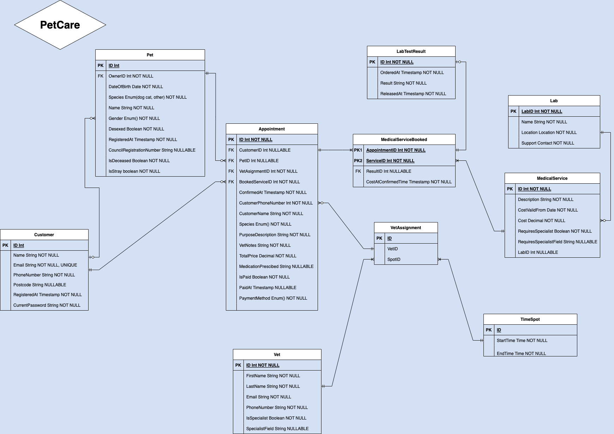

## PetCare vet system domain - Functional requirements
- Vet PetCare is located in Sydney.
- Anyone can create an account and become a user.
- 1 customer's email address can register 1 account only.
- Anyone, not just registered customers, can make bookings.
- However, for an appointment to be booked successfully, it requires customer's name, phone number, pet type, booking purpose - description, date, time, and branch.
- Anyone including users can book multiple appointments.
- Pet's name, customer's email address, and customer postcode are optional in an appointment, however, customers are encouraged to give such information and register to be a user, and also register their pet(s).
- At the vet's, there are also different medicines in stock for treatments at the vet and for customer to buy and perform treatments at home.
- During the appointments, different health services like X-ray, blood work, special eye check, vaccinations, surgeries,... may be performed. All services have different code and price.
- When a pet is registered, the pet's council registration number is optional. This will allow future changes of info and integration with the local council system for pets.
- 1 veterinarian can have many bookings and many bookings can be done by 1 customer
- There are two entities: specialist team and general practitioner team. Specialist team will perform complicated tasks such as surgery, while general practitioner team will perform simpler tasks like grooming, ...
- PetCare collaborates with a number of third party Labs that provide medical lab study services.

**For registered customers, a.k.a users:**
- A user can log in through a login portal, register one or multiple pets, and make private information changes, make bookings...
- A user can change details of an existing booking.
- A user can choose to pay online for a performed service or at the counter. Guests will have to pay at the counter in full amount
- A user can choose the vet for their pet --> constraint: vet needs to be available at the time of the booking.
- Hence, bookings cannot be made for one veterinarian at the same time slot.
- A user can change the pet's information where relevant, and request to change other information where vet staff need to double-check the information before the change.
- Pets need to be linked with customer accounts, so customer accounts need to be registered first in order to register for pet details.
- In special circumstances where registering an owner for a pet is not an option, the pet can be registered under a special owner account - UnknownOwner.
- The system needs to check time slot availability before allow customer to select the time slot.
- A user can change their password. Each password will only valid between the time when it's created and when it's changed to a new password.
- A user can make multiple login attempts. If correct credentials are given, login succeeds, otherwise, it fails.
- An email will be sent to user's email address every time they change their password, everytime an appointment is made, everytime their details are changed, ...
- In an appointment, the vet can order one or many lab tests, or create one or more presciptions for the pet.

## Non-functional requirements identified
None at the current state. However, some can be identified for extended functionalities.

## Entity Relationship Diagram

## Prospective extended functionalities:
- **(security)** Encode users' passwords in the db.
- **(functionalities)** Slot will only be reserved for 10 minutes since the time when the picking is selected.
- **(functionalities)** Integrates with a staff system which manages staff's privileges
- **(functionalities)** Pet rescuers can register to be a registered pet rescuers to receive vouchers, discounts and donations. And occasionally, PetCare gives out vouchers and discounts to pet rescuers
- **(security)** Supports users based in Australia; Blocks suspicious IP addresses; Firewall; Prevent DoS, DDoS;
- **(functionalities)** Integrate with other third parties to extend payment options e.g, Afterpay, ...
- **(functionalities)** For each successful login, the session will time out after a certain time of inactivity. User's account will be locked for 30 minutes and an email will be sent to user's email address after 5 failed login attempts.
- **(security)** Regarding password reset, new passport cannot be the same as one of the last 3 passwords.
